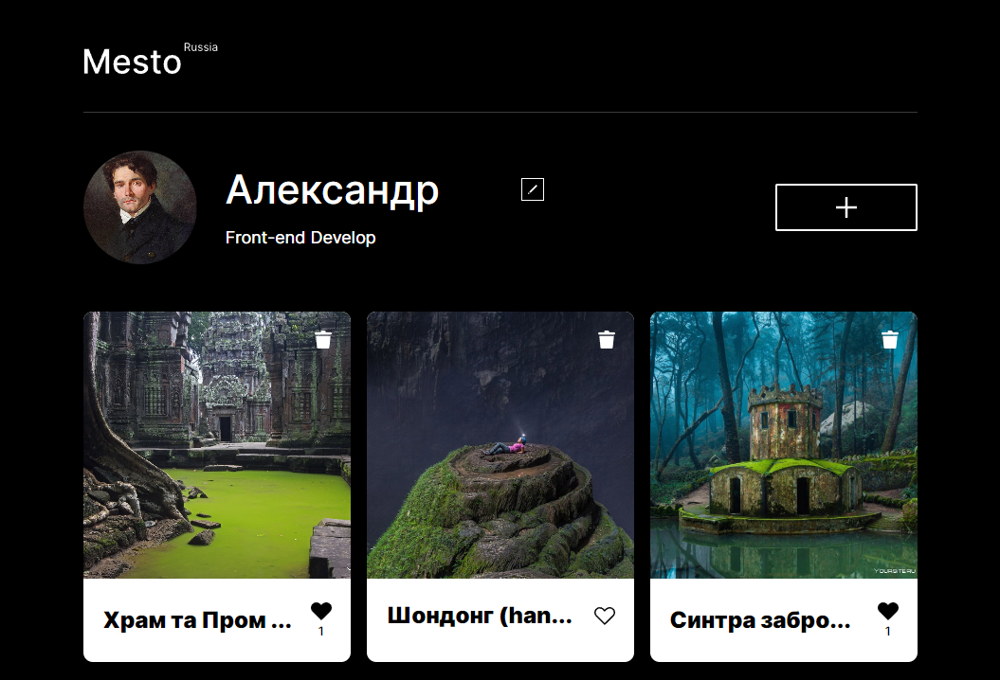
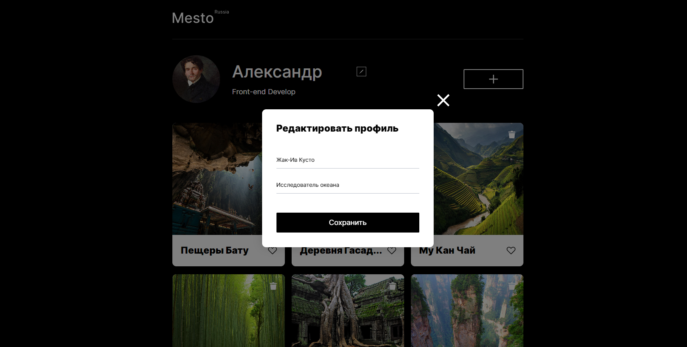
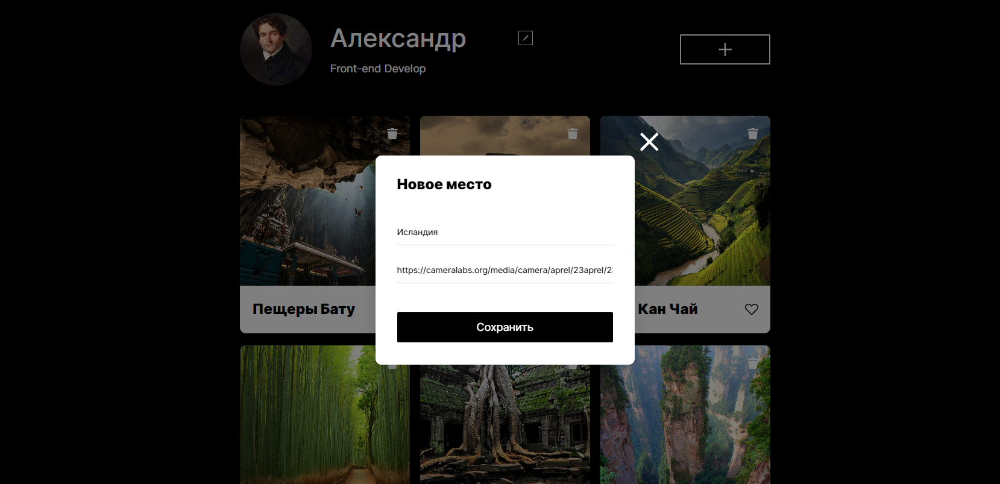
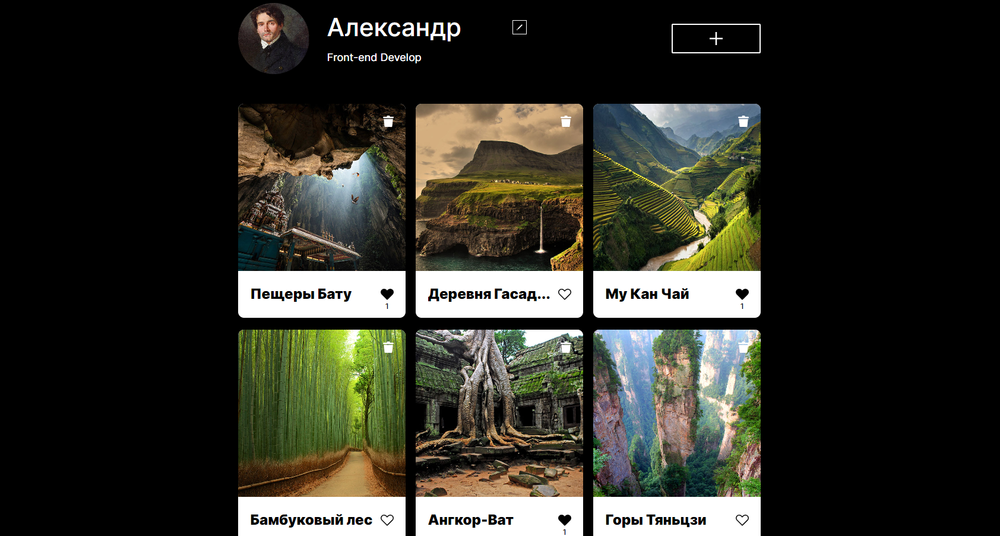
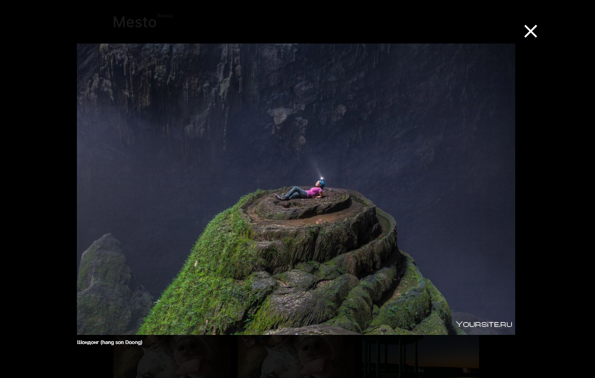
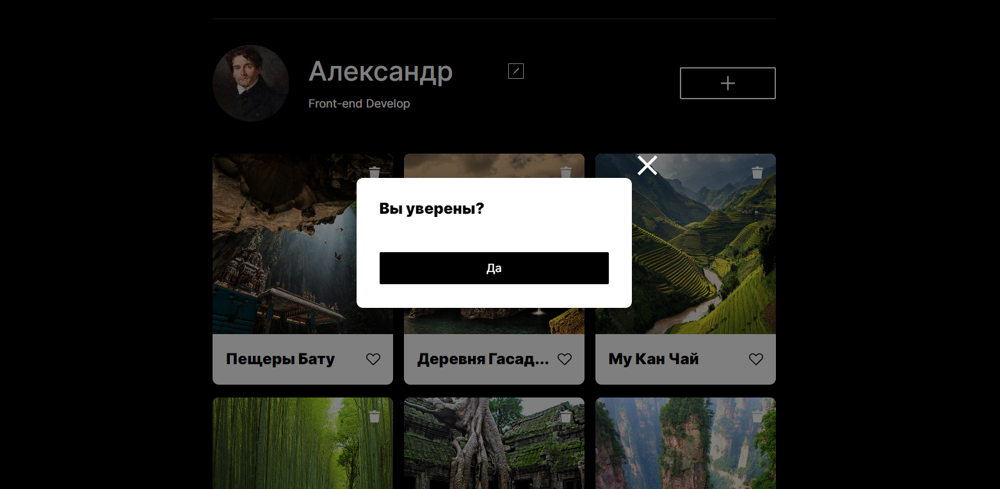

<a name="readme-top"></a>


[![Contributors][contributors-shield]][contributors-url] [![Forks][forks-shield]][forks-url] [![Stargazers][stars-shield]][stars-url] [![Issues][issues-shield]][issues-url]
<br>
 
<!-- [![MIT License][license-shield]][license-url]
[![LinkedIn][linkedin-shield]][linkedin-url] -->


<br />
<div align="end">
  <a href="https://alexandergrams.github.io/mesto-react/">
    
  </a>

  <h3 align="start">Проект: "Место"</h3>

  <p align="start">
    Данная работа выполняется в рамках образовательной программы <a href="https://practicum.yandex.ru/">Яндекс Практикума</a>. Проект представляет собой создание отзывчиво-адаптивного интерфейса, а так же работа с удаленной базой данных с использованием современной технологии <a href="https://reactjs.org/">React</a>. Он повторяет основной функционал популярных соцсетей: <a href="https://www.instagram.com/">Instagram</a>, <a href="https://www.facebook.com/">Facebook</a>, <a href="https://vk.com/">VKontakte</a>.
  </p>
</div>

---


<!-- TABLE OF CONTENTS -->
<details>
  <summary>Содержание</summary>
  <ol>
    <li>
      <a href="#о-проекте">О проекте</a>
      <ul>
        <li><a href="#функционал">Функционал</a></li>
        <li><a href="#стек-технологий">Стек технологий</a></li>
      </ul>
    </li>
    <li><a href="#установка">Установка</a></li>
    <li><a href="#использование">Использование</a></li>
    <li><a href="#contributing">Contributing</a></li>
    <li><a href="#контакты">Контакты</a></li>
    <li><a href="#планы-по-доработке">Планы по доработке</a></li>
  </ol>
</details>


<!-- ABOUT THE PROJECT -->
## О проекте


Данный проект - это второй этап создания социальной сети с возможностью размещения изображений. Работа представляет собой портирование на "Реакт", созданного ранее <a href="https://github.com/AlexanderGrams/mesto">адаптивного одностраничного сайта</a> с профилем пользователя и фотокарточками, изначально написанного на нативных технологиях: HTML5, CSS3 и JavaScript. Так же замена объектно-ориентированной парадигмы программирования на функционально-ориентированную.

<a href="https://alexandergrams.github.io/mesto-react/"></a>


### Функционал

* Адаптивный интерфейс
* Обмен данными с сервером
* Открытие и закрытие модальных окон (по кнопке, оверлею и клавише "Escape")
* Модальное окно с увеличенной фотографией карточки
* Редактирование информации пользователя
* Обновление аватара
* Добавление новой карточки
* Добавление и снятие лайка (включая счетчик лайков)
* Удаление карточки с модальным окном подтверждения действия
* Спиннеры загрузки
* Валидация форм


### Стек технологий

В проекте использпользовались: 

* [![React][React.js]][React-url]
    * <a href="https://reactjs.org/docs/context.html">React context</a>
    * <a href="https://reactjs.org/docs/hooks-overview.html">React hoocks</a>
    * <a href="https://reactrouter.com/en/main">React router</a>
* [![JavaScript][JavaScript]][JavaScript-url]
    * <a href="https://reactjs.org/docs/introducing-jsx.html">расширение jsx</a>
* [![Webpack][Webpack]][Webpack-url]
* [![Npm][Npm]][Npm-url]
* [![Babel][Babel]][Babel-url]
* [![BEM][Bem]][Bem-url]
    * <a href="https://ru.bem.info/methodology/filestructure/#nested">BEM nested</a>

<p align="right">(<a href="#readme-top">вернуться на верх</a>)</p>


<!-- GETTING STARTED -->
## Установка

Для запуска проекта в своей среде разработке следуйте следующим инструкциям:

1. Клонируйте репозиторий
   ```sh
   git clone https://github.com/AlexanderGrams/mesto-react.git
   ```
2. Установите пакеты NPM
   ```sh
   npm install
   ```
3. Install NPM packages
   ```sh
   npm install
   ```
4. Запустить приложение
   ```sh
   npm start
   ```
>* Если у вас не произошел автоматический переход в браузер с открытым приложением, введите в адресную строку самостоятельно -  [http://localhost:3000](http://localhost:3000)
>* В процессе изменения кода страница будет автоматически перезагружаться. 


<p align="right">(<a href="#readme-top">вернуться на верх</a>)</p>


<!-- USAGE EXAMPLES -->
## Использование
В приложении вы можете:
<br>

* Редактировать информацию о себе и изменять свой аватар
<br>

<a href="https://alexandergrams.github.io/mesto-react/"></a>
<br>

* Добавлять фото карточки с подписями, для этого необходимо придумать подпись и вставить ссылку на изображение
<br>

<a href="https://alexandergrams.github.io/mesto-react/"></a>
<br>

* Оставлять реакцию на свои и чужие фотокарточки
<br>

<a href="https://alexandergrams.github.io/mesto-react/"></a>
<br>

* Открывать изображения из фотокарточек в полном разрешении изображения
<br>

<a href="https://alexandergrams.github.io/mesto-react/"></a>
<br>

* Удалять карточки нажав корзину и далее подтвердив действие
<br>

<a href="https://alexandergrams.github.io/mesto-react/"></a>

<p align="right">(<a href="#readme-top">вернуться на верх</a>)</p>


<!-- Plans for completion -->
## Планы по доработке

* добавить авторизацию пользователя и возможность регистрации
* добавление периодического автоматического обновления галереи карточек
* добавление функции сабмита форм нажатием на клавишу "Enter" (в настоящий момент работает только в случае клика пользователем по полю формы)
* добавить ссылочную навигацию и страницу "404"

<p align="right">(<a href="#readme-top">вернуться на верх</a>)</p>


<!-- CONTRIBUTING -->
## Contributing

Если у вас есть предложение, которое сделало бы это проект лучше, пожалуйста, разветвите репозиторий и создайте запрос на извлечение. Вы также можете просто открыть проблему с тегом "улучшение". Спасибо за ваш вклад!

1. Скопируйте себе проект.
2. Создайте свою ветку удивительной функциональности (`git checkout -b feature/AmazingFeature`)
3. Зафиксируйте свои изменения (`git commit -m 'Add some AmazingFeature'`)
4. Толкните свою ветку (`git push origin feature/AmazingFeature`)
5. Откройте запрос на извлечение

<p align="right">(<a href="#readme-top">вернуться на верх</a>)</p>


<!-- CONTACT -->
## Контакты

Александр Грамс (разработчик):
 - Телеграм - [@Monteg_451](https://t.me/Monteg_451)
 - Email - Alexander.Grams@yandex.ru

>Ссылка на проект: [https://github.com/AlexanderGrams/mesto-react](https://github.com/AlexanderGrams/mesto-react)

>Ссылка на Github Pages: [https://alexandergrams.github.io/mesto-react/](https://alexandergrams.github.io/mesto-react/)

<p align="right">(<a href="#readme-top">вернуться на верх</a>)</p>


<!-- MARKDOWN LINKS & IMAGES -->
<!-- https://www.markdownguide.org/basic-syntax/#reference-style-links -->
[contributors-shield]: https://img.shields.io/github/contributors/AlexanderGrams/mesto-react.svg?style=for-the-badge
[contributors-url]: https://github.com/AlexanderGrams/mesto-react/graphs/contributors
[forks-shield]: https://img.shields.io/github/forks/AlexanderGrams/mesto-react.svg?style=for-the-badge
[forks-url]: https://github.com/AlexanderGrams/mesto-react/network/members
[stars-shield]: https://img.shields.io/github/stars/AlexanderGrams/mesto-react.svg?style=for-the-badge
[stars-url]: https://github.com/AlexanderGrams/mesto-react/stargazers
[issues-shield]: https://img.shields.io/github/issues/AlexanderGrams/mesto-react.svg?style=for-the-badge
[issues-url]: https://github.com/AlexanderGrams/mesto-react/issues
[license-shield]: https://img.shields.io/github/license/AlexanderGrams/mesto-react.svg?style=for-the-badge
[license-url]: https://github.com/AlexanderGrams/mesto-react/blob/master/LICENSE.txt
[linkedin-shield]: https://img.shields.io/badge/-LinkedIn-black.svg?style=for-the-badge&logo=linkedin&colorB=555
[linkedin-url]: https://linkedin.com/in/othneildrew
[product-screenshot]: images/screenshot.png


[JavaScript]: https://img.shields.io/badge/JavaScript-20232A?style=for-the-badge&logo=javascript&logoColor=f7e01d
[JavaScript-url]: https://www.javascript.com/
[React.js]: https://img.shields.io/badge/React-20232A?style=for-the-badge&logo=react&logoColor=61DAFB
[React-url]: https://reactjs.org/
[Webpack]: https://img.shields.io/badge/webpack-20232A?style=for-the-badge&logo=webpack&logoColor=75afcc
[Webpack-url]: https://webpack.js.org/
[Npm]: https://img.shields.io/badge/npm-20232A?style=for-the-badge&logo=npm&logoColor=BC3433
[Npm-url]: https://www.npmjs.com/
[Babel]: https://img.shields.io/badge/babel-20232A?style=for-the-badge&logo=babel&logoColor=f5da55
[Babel-url]: https://babeljs.io/
[BEM]: https://img.shields.io/badge/BEM-20232A?style=for-the-badge&logo=bem&logoColor=ffffff
[BEM-url]: https://ru.bem.info/
